# B0 도메인 모델

## 도메인 개요

B0는 "지하 0층에서 출발하는 비행선을 타고 가상 세계를 여행하며 힐링과 자기성찰을 경험하는 온라인 커뮤니티"입니다.

사용자는 B0 비행선 터미널에서 6개의 테마별 도시 중 하나를 선택하여 비행선을 타고 이동하고, 도착 후 게스트하우스에 체크인하여 다른 여행자들과 대화를 나누거나 일기를 쓰며 자기성찰의 시간을 가집니다.

---

## 유비쿼터스 언어 (Ubiquitous Language)

도메인 전문가와 개발자 간의 공통 언어:

### 핵심 용어

- **B0 (지하 0층)**: 비행선 터미널이 있는 가상의 시작 공간
- **여행자 (Traveler)**: 서비스를 이용하는 사용자
- **도시 (City)**: 6개의 테마별 목적지 (세렌시아, 로렌시아, 에테리아, 드리모스, 셀레니아, 아벤투라)
- **비행선 (Airship)**: 도시로 이동하는 교통 수단의 타입. cost_factor(가격 배수)와 duration_factor(시간 배수)로 비용과 시간을 조절 (예: 일반 비행선, 고속 비행선)
- **티켓 (Ticket)**: 비행선 탑승권
- **게스트하우스 (Guesthouse)**: 도시에 있는 숙소
- **룸 (Room)**: 게스트하우스 내 최대 6명이 머무르며 대화하는 공간
- **체류 (Stay)**: 룸에서 머무는 것 (기본 24시간)
- **체크인 (Check-in)**: 룸 입실
- **체크아웃 (Check-out)**: 룸 퇴실 (자동 또는 수동)
- **연장 (Extension)**: 체크아웃 시간을 24시간 연장
- **단체 대화 (Group Chat)**: 룸 내 모든 여행자가 참여하는 대화
- **1:1 대화 (Direct Message)**: 룸 내 특정 두 여행자 간의 대화
- **대화 카드 (Conversation Card)**: 대화 주제를 제공하는 질문 카드
- **일기 (Diary)**: 하루의 기록 (500자, 하루 1회 50P)
- **문답지 (Questionnaire)**: 도시별 3개 질문에 답변 (도시별 1회 50P)
- **포인트 (Points)**: 서비스 내 화폐 (티켓 구매, 연장 등에 사용)

### 비즈니스 규칙

- **Guesthouse는 영구적**: 도시의 게스트하우스는 항상 존재
- **Room은 동적 생성/삭제**:
  - 첫 번째 여행자 체크인 시 새 룸 생성
  - 모든 여행자 체크아웃 시 룸 삭제
  - 최대 6명까지 같은 룸에 배정
- **개별 체크인/체크아웃**:
  - 각 여행자의 체크인 시간이 다름
  - 각자 체크인 시간 + 24시간 = 개별 체크아웃 시간
  - 연장도 개인별 (300P/24시간)
- **자동 룸 배정**: 도착 시 6명 미만인 활성 룸에 배정, 없으면 새 룸 생성
- **메시지 3일 보관**: 채팅 메시지는 3일 후 자동 삭제
- **포인트 획득 제한**: 일기는 하루 1회, 문답지는 도시별 1회만 포인트 획득
- **메시지 길이 제한**: 채팅 메시지 300자, 일기 500자, 문답지 답변 200자
- **메시지 전송 제한 (스팸 방지)**: 2초에 1회 전송 제한 (Redis Rate Limiting)
- **대화 카드 사용**: 무제한 사용 가능 (동일 카드 중복 선택 가능)

---

## 바운디드 컨텍스트 (Bounded Contexts)

```mermaid
graph TB
    subgraph UserContext[사용자 컨텍스트]
        User[User<br/>여행자]
        Profile[Profile<br/>프로필]
    end

    subgraph TravelContext[여행 컨텍스트]
        City[City<br/>도시]
        Ticket[Ticket<br/>티켓]
        Airship[Airship Logic<br/>비행선 로직]
    end

    subgraph RoomContext[룸 컨텍스트]
        Guesthouse[Guesthouse<br/>게스트하우스]
        Room[Room<br/>룸<br/>체류+대화 공간]
        RoomStay[RoomStay<br/>체류]
        RoomAssignment[Room Assignment<br/>자동 룸 배정]
        Checkout[Checkout Logic<br/>체크아웃 로직]
    end

    subgraph ChatContext[단체 대화 컨텍스트]
        ChatMessage[ChatMessage<br/>룸 내 단체 메시지]
        ConversationCard[ConversationCard<br/>대화 카드]
    end

    subgraph DMContext[1:1 대화 컨텍스트]
        DMRoom[DirectMessageRoom<br/>1:1 대화방]
        DirectMessage[DirectMessage<br/>1:1 메시지]
    end

    subgraph ReflectionContext[자기성찰 컨텍스트]
        Diary[Diary<br/>일기]
        Questionnaire[Questionnaire<br/>문답지]
    end

    subgraph PointContext[포인트 컨텍스트]
        PointTransaction[PointTransaction<br/>포인트 거래]
        PointBalance[Point Balance<br/>포인트 잔액]
    end

    UserContext -->|구매| TravelContext
    TravelContext -->|도착/체크인| RoomContext
    RoomContext -->|단체 대화| ChatContext
    RoomContext -->|1:1 대화| DMContext
    UserContext -->|작성| ReflectionContext
    UserContext -->|거래| PointContext
    TravelContext -->|티켓 구매<br/>포인트 차감| PointContext
    RoomContext -->|연장<br/>포인트 차감| PointContext
    ReflectionContext -->|일기/문답지<br/>포인트 획득| PointContext

    style UserContext fill:#e1f5ff
    style TravelContext fill:#fff4e1
    style RoomContext fill:#ffe1e1
    style ChatContext fill:#e1ffe1
    style DMContext fill:#d4f1e1
    style ReflectionContext fill:#f4e1ff
    style PointContext fill:#ffe1f4
```



### 1. 사용자 컨텍스트 (User Context)

**책임**: 사용자 인증, 프로필 관리

**핵심 개념**:
- User (여행자)
- Profile (닉네임, 이모지)
- Authentication (이메일/비밀번호 인증)

### 2. 여행 컨텍스트 (Travel Context)

**책임**: 도시 탐색, 비행선 티켓 구매 및 이동

**핵심 개념**:
- City (도시)
- Ticket (티켓)
- Airship (비행선 타입: 일반/쾌속)
- Travel Duration (이동 시간)

### 3. 룸 컨텍스트 (Room Context)

**책임**: 게스트하우스 룸 배정, 체크인/체크아웃 관리, 여행자 체류

**핵심 개념**:
- Guesthouse (게스트하우스)
- Room (여행자들이 체류하고 대화하는 공간)
- RoomStay (체류 기록)
- Check-in/Check-out
- Extension (연장)
- Auto Room Assignment (자동 룸 배정)

### 4. 단체 대화 컨텍스트 (Chat Context)

**책임**: 룸 내 모든 여행자가 참여하는 단체 대화

**핵심 개념**:
- ChatMessage (룸 내 단체 메시지)
- ConversationCard (대화 카드)
- Message Expiration (메시지 만료)

### 5. 1:1 대화 컨텍스트 (DirectMessage Context)

**책임**: 룸 내 특정 두 여행자 간 1:1 대화

**핵심 개념**:
- DirectMessageRoom (1:1 대화방)
- DirectMessage (1:1 메시지)
- Conversation Request (대화 신청/수락/거절)

### 6. 자기성찰 컨텍스트 (Self-Reflection Context)

**책임**: 일기, 문답지 작성 및 관리

**핵심 개념**:
- Diary (일기)
- Questionnaire (문답지)
- City Questions (도시별 질문)

### 7. 포인트 컨텍스트 (Point Context)

**책임**: 포인트 획득, 사용, 잔액 관리

**핵심 개념**:
- PointTransaction (포인트 거래)
- Point Balance (포인트 잔액)
- Earn/Spend Rules (획득/사용 규칙)

---

## 애그리게이트 (Aggregates)

### 1. User Aggregate

**애그리게이트 루트**: User

**엔티티**:
- User (여행자)

**값 객체**:
- Email
- Password
- Nickname
- ProfileEmoji
- PointBalance

**불변식**:
- 이메일은 유일해야 함
- 닉네임은 유일해야 함 (2-10자)
- 포인트는 음수가 될 수 없음

### 2. Travel Aggregate

**애그리게이트 루트**: Ticket

**엔티티**:
- Ticket (티켓)
- City (도시) - 기준 가격과 기준 비행 시간을 가짐
- Airship (비행선) - 가격 배수와 시간 배수를 가짐

**값 객체**:
- TicketStatus (PURCHASED, BOARDING, COMPLETED, CANCELED)

**비용/시간 계산**:
- 티켓 비용 = City.base_cost_points × Airship.cost_factor
- 이동 시간 = City.base_duration_hours × Airship.duration_factor
- 예: 세렌시아(100P, 1h) + 일반 비행선(×1, ×3) = 100P, 3시간
- 예: 세렌시아(100P, 1h) + 고속 비행선(×2, ×1) = 200P, 1시간

**불변식**:
- 티켓은 활성화된 도시로만 발권 가능
- 티켓은 활성화된 비행선으로만 발권 가능
- 티켓 비용은 도시 기준 가격 × 비행선 가격 배수로 계산
- 이동 시간은 도시 기준 시간 × 비행선 시간 배수로 계산

### 3. Room Aggregate

**애그리게이트 루트**: Room

**엔티티**:
- Room (룸 - 동적으로 생성/삭제되는 체류 및 대화 공간)
- RoomStay (개별 여행자의 체류 기록)
- Guesthouse (게스트하우스 - 영구적 컨테이너)

**값 객체**:
- RoomCapacity (최대 6명)
- CheckInTime (개별)
- CheckOutTime (개별)
- ExtensionCount (개별)
- RoomStatus (ACTIVE, FULL)

**불변식**:
- 룸 정원은 최대 6명
- 각 여행자의 체크인 시간은 독립적
- 각 여행자는 체크인 시간 + 24시간 후 자동 체크아웃
- 모든 여행자가 체크아웃하면 룸 soft delete (deleted_at 설정)

**도메인 로직**:
- **룸 생성**: 첫 번째 여행자 체크인 시 새 룸 생성
- **자동 룸 배정**: 6명 미만인 활성 룸에 배정, 없으면 새 룸 생성
- **개별 체크인**: 각 여행자마다 고유한 체크인/체크아웃 시간
- **개별 연장**: 각 여행자가 독립적으로 300P로 24시간 연장
- **룸 삭제**: 마지막 여행자 체크아웃 시 `deleted_at` 설정 (soft delete), 배치로 실제 삭제
- **룸 대화**: 현재 체류 중인 여행자들 간 대화

### 4. Chat Aggregate

**애그리게이트 루트**: ChatMessage

**엔티티**:
- ChatMessage (룸 내 단체 대화 메시지)
- ConversationCard (대화 카드)

**값 객체**:
- MessageContent (최대 300자)
- MessageType (TEXT, CARD_SHARED, SYSTEM)
- ExpirationTime (3일)

**불변식**:
- 메시지는 최대 300자
- 채팅 메시지는 3일 후 자동 삭제
- 메시지는 체류 중인 룸에만 전송 가능

**도메인 로직**:
- **메시지 전송**: 룸 내 모든 여행자에게 브로드캐스트
- **대화 카드 공유**: 랜덤 카드 선택 후 룸에 공유
- **메시지 만료**: 3일 후 자동 삭제

### 5. DirectMessage Aggregate

**애그리게이트 루트**: DirectMessageRoom

**엔티티**:
- DirectMessageRoom (1:1 대화방)
- DirectMessage (1:1 메시지)

**값 객체**:
- MessageContent (최대 300자)
- DMStatus (PENDING, ACCEPTED, REJECTED, ACTIVE, ENDED)

**불변식**:
- 메시지는 최대 300자
- 1:1 대화는 같은 룸 내에서만 가능
- 1:1 대화는 체크아웃 시 삭제

**도메인 로직**:
- **대화 신청**: 같은 룸 여행자에게 1:1 대화 신청
- **수락/거절**: 수락 시 대화방 활성화
- **메시지 전송**: 대화방 내 두 여행자 간 메시지 교환
- **대화방 종료**: 체크아웃 시 자동 삭제

### 6. Reflection Aggregate

**애그리게이트 루트**: Diary, Questionnaire

**엔티티**:
- Diary (일기)
- Questionnaire (문답지)

**값 객체**:
- DiaryContent (최대 500자)
- DiaryMood (이모지)
- QuestionnaireAnswer (최대 200자)
- DiaryDate

**불변식**:
- 일기는 하루 1개 (user_id, diary_date 유일)
- 문답지는 도시별 1개 (user_id, city_id 유일)
- 일기는 500자, 문답지 답변은 200자
- 일기/문답지는 본인만 조회 가능

**도메인 로직**:
- **일기 작성**: 하루 1회 포인트 획득 (50P)
- **문답지 작성**: 도시별 1회 포인트 획득 (50P)

### 7. Point Aggregate

**애그리게이트 루트**: User (포인트 잔액 포함)

**엔티티**:
- PointTransaction (포인트 거래)

**값 객체**:
- TransactionType (EARN, SPEND)
- TransactionReason (SIGNUP, DIARY, QUESTIONNAIRE, TICKET, EXTENSION)
- TransactionStatus (PENDING, COMPLETED, FAILED)

**불변식**:
- 포인트는 음수가 될 수 없음
- 포인트 부족 시 결제 불가
- 모든 거래는 트랜잭션으로 처리

**도메인 로직**:
- **포인트 획득**: SIGNUP(1000P), DIARY(50P/일), QUESTIONNAIRE(50P/도시)
- **포인트 사용**: TICKET(300P/500P), EXTENSION(300P)
- **잔액 계산**: balance_after = balance_before + amount (EARN) 또는 - amount (SPEND)

---

## 도메인 모델 다이어그램

```mermaid
graph TB
    subgraph UserAggregate[User Aggregate]
        User[User<br/>여행자<br/>AR]
        Email[Email<br/>VO]
        Nickname[Nickname<br/>VO]
        Points[PointBalance<br/>VO]
        User --> Email
        User --> Nickname
        User --> Points
    end

    subgraph TravelAggregate[Travel Aggregate]
        Ticket[Ticket<br/>티켓<br/>AR]
        City[City<br/>도시]
        Ticket --> City
    end

    subgraph RoomAggregate[Room Aggregate]
        Room[Room<br/>룸<br/>체류+대화 공간<br/>AR]
        RoomStay[RoomStay<br/>체류 기록]
        Guesthouse[Guesthouse<br/>게스트하우스]
        RoomCapacity[Capacity<br/>VO]
        CheckInOut[CheckInOut<br/>VO]
        Room --> Guesthouse
        Room --> RoomStay
        Room --> RoomCapacity
        RoomStay --> CheckInOut
    end

    subgraph ChatAggregate[Chat Aggregate]
        ChatMessage[ChatMessage<br/>단체 메시지<br/>AR]
        ConversationCard[ConversationCard<br/>대화 카드]
        ChatContent[MessageContent<br/>VO]
        ChatMessage --> ConversationCard
        ChatMessage --> ChatContent
    end

    subgraph DMAggregate[DirectMessage Aggregate]
        DMRoom[DMRoom<br/>1:1 대화방<br/>AR]
        DirectMessage[DirectMessage<br/>1:1 메시지]
        DMContent[MessageContent<br/>VO]
        DMRoom --> DirectMessage
        DirectMessage --> DMContent
    end

    subgraph ReflectionAggregate[Reflection Aggregate]
        Diary[Diary<br/>일기<br/>AR]
        Questionnaire[Questionnaire<br/>문답지<br/>AR]
        DiaryContent[DiaryContent<br/>VO]
        QuestionAnswer[QuestionAnswer<br/>VO]
        Diary --> DiaryContent
        Questionnaire --> QuestionAnswer
    end

    subgraph PointAggregate[Point Aggregate]
        PointTransaction[PointTransaction<br/>포인트 거래]
        TransactionType[TransactionType<br/>VO]
        TransactionReason[TransactionReason<br/>VO]
        PointTransaction --> TransactionType
        PointTransaction --> TransactionReason
    end

    User -->|구매| Ticket
    Ticket -->|체크인| RoomStay
    User -->|체류| RoomStay
    User -->|연장| RoomStay
    RoomStay -.->|소속 룸| Room
    RoomStay -.->|연장 시<br/>포인트 차감| PointTransaction
    ChatMessage -.->|전송된 룸| Room
    DMRoom -.->|생성된 룸| Room
    User -->|작성| Diary
    User -->|작성| Questionnaire
    User -->|거래| PointTransaction
    Ticket -.->|구매 시<br/>포인트 차감| PointTransaction
    Diary -.->|작성 시<br/>포인트 획득| PointTransaction
    Questionnaire -.->|완성 시<br/>포인트 획득| PointTransaction

    style UserAggregate fill:#e1f5ff
    style TravelAggregate fill:#fff4e1
    style RoomAggregate fill:#ffe1e1
    style ChatAggregate fill:#e1ffe1
    style DMAggregate fill:#d4f1e1
    style ReflectionAggregate fill:#f4e1ff
    style PointAggregate fill:#ffe1f4
```



**범례**:
- **AR**: Aggregate Root
- **VO**: Value Object
- 실선: 강한 연관
- 점선: 약한 연관

---

## 엔티티 (Entities)

### User (여행자)

**식별자**: user_id (UUID v7)

**속성**:
- email: Email (VO)
- password_hash: String
- nickname: Nickname (VO)
- profile_emoji: ProfileEmoji (VO)
- current_points: PointBalance (VO)
- is_active: Boolean

**책임**:
- 회원가입/로그인
- 프로필 관리
- 포인트 잔액 관리

### City (도시)

**식별자**: city_id (UUID v7)

**속성**:
- name: String (예: 세렌시아)
- theme: String (예: 관계의 도시)
- description: Text
- image_url: String
- base_cost_points: Integer (기준 가격, 예: 100P)
- base_duration_hours: Integer (기준 비행 시간, 예: 1시간)
- is_active: Boolean
- display_order: Integer (도시 표시 순서)

**책임**:
- 도시 정보 제공
- 기준 가격 및 기준 비행 시간 제공
- 활성화 상태 관리
- 도시 표시 순서 관리

### Airship (비행선)

**식별자**: airship_id (UUID v7)

**속성**:
- name: String (예: "일반 비행선", "고속 비행선")
- description: Text
- image_url: String
- cost_factor: Integer (가격 배수, 예: 1, 2)
- duration_factor: Integer (시간 배수, 예: 3, 1)
- display_order: Integer (표시 순서)
- is_active: Boolean

**책임**:
- 비행선 타입 정보 제공
- 가격 및 시간 배수 제공
- 활성화 상태 관리

**시드 데이터**:
- 일반 비행선: cost_factor=1, duration_factor=3
- 고속 비행선: cost_factor=2, duration_factor=1

### Ticket (티켓)

**식별자**: ticket_id (UUID v7)

**속성**:
- user_id: UUID (FK)
- city_id: UUID (FK)
- airship_id: UUID (FK)
- ticket_number: String (장식용, 예: "B0-2025-001234")
- cost_points: Integer (계산됨: City.base_cost_points × Airship.cost_factor)
- departure_time: DateTime
- arrival_time: DateTime (계산됨: departure_time + City.base_duration_hours × Airship.duration_factor)
- status: TicketStatus (VO)

**책임**:
- 티켓 발권
- 티켓 번호 생성 (형식: "B0-{년도}-{일련번호}")
- 비용 및 이동 시간 계산 (City × Airship factor)
- 도착 처리

### Guesthouse (게스트하우스)

**식별자**: guesthouse_id (UUID v7)

**속성**:
- city_id: UUID (FK)
- name: String
- guesthouse_type: GuesthouseType (MIXED, QUIET)
- description: Text
- image_url: String
- is_active: Boolean

**책임**:
- 도시의 영구적인 숙소 컨테이너
- 게스트하우스 정보 제공
- 타입별 특성 정의 (혼합형/조용한 방)
- Room들의 상위 그룹

**생명주기**: 영구적 (삭제되지 않음)

### Room (룸)

**식별자**: room_id (UUID v7)

**속성**:
- guesthouse_id: UUID (FK)
- room_name: String
- room_number: Integer (게스트하우스별 증가)
- max_capacity: Integer (기본 6)
- current_capacity: Integer
- status: RoomStatus (VO)

**책임**:
- 여행자들이 체류하는 동적 공간
- 단체 대화가 이루어지는 공간
- 1:1 대화가 시작되는 공간
- 룸 정원 관리 (최대 6명)
- 룸 상태 관리 (ACTIVE, FULL)

**생명주기**:
- **생성**: 첫 번째 여행자 체크인 시
- **활성**: 1명 이상 체류 중
- **만원**: 6명 체류 중 (새 여행자 배정 불가)
- **삭제**: 마지막 여행자 체크아웃 시 `deleted_at` 설정 (soft delete), 배치로 실제 삭제

### RoomStay (체류)

**식별자**: stay_id (UUID v7)

**속성**:
- room_id: UUID (FK)
- user_id: UUID (FK)
- ticket_id: UUID (FK)
- check_in_time: DateTime (개별)
- scheduled_checkout_time: DateTime (개별)
- actual_checkout_time: DateTime (nullable)
- extension_count: Integer (개별, 기본값 0)
- total_extension_cost: Integer (개별, 기본값 0)
- status: RoomStayStatus (VO)

**책임**:
- **개별 여행자의 체류 기록 관리**
- 각 여행자의 고유한 체크인 시간 기록
- 각 여행자의 고유한 체크아웃 시간 계산 (체크인 + 24시간)
- 개별 연장 처리 (300P/24시간)
- 개별 체크아웃 처리 (자동 또는 수동)

**도메인 로직**:
- **extend()**: 체류 연장
  - scheduled_checkout_time에 24시간 추가
  - extension_count 증가
  - total_extension_cost에 300P 누적
  - 포인트 차감은 PointTransactionService를 통해 처리
- **checkout()**: 체크아웃 처리
  - status를 CHECKED_OUT으로 변경
  - actual_checkout_time 기록

**불변식**:
- 한 여행자는 동시에 하나의 활성 체류만 가능
- scheduled_checkout_time = check_in_time + 24시간 + (extension_count × 24시간)
- extension_count >= 0
- total_extension_cost = extension_count × 300P

### ChatMessage (단체 대화 메시지)

**식별자**: message_id (UUID v7)

**속성**:
- room_id: UUID (FK)
- user_id: UUID (FK)
- content: MessageContent (VO)
- card_id: UUID (FK, nullable)
- message_type: MessageType (VO)
- is_system: Boolean
- expires_at: DateTime

**책임**:
- 룸 내 모든 여행자에게 메시지 전송
- 메시지 만료 (3일 후 자동 삭제)
- 대화 카드 공유

### ConversationCard (대화 카드)

**식별자**: card_id (UUID v7)

**속성**:
- city_id: UUID (FK, nullable)
- question: Text
- category: String
- is_active: Boolean

**책임**:
- 룸 내 단체 대화를 위한 주제 제공
- 도시별/공용 카드 관리
- 랜덤 카드 선택

### DirectMessageRoom (1:1 대화방)

**식별자**: dm_room_id (UUID v7)

**속성**:
- guesthouse_id: UUID (FK)
- room_id: UUID (FK)
- user1_id: UUID (FK, 신청자)
- user2_id: UUID (FK, 수신자)
- status: DMStatus (VO)
- started_at: DateTime
- ended_at: DateTime

**책임**:
- 같은 룸 내 여행자 간 1:1 대화방 생성
- 대화 신청/수락/거절 관리
- 체크아웃 시 대화방 자동 삭제

### DirectMessage (1:1 메시지)

**식별자**: dm_id (UUID v7)

**속성**:
- dm_room_id: UUID (FK)
- from_user_id: UUID (FK)
- to_user_id: UUID (FK)
- content: MessageContent (VO)
- is_read: Boolean

**책임**:
- 1:1 메시지 전송
- 읽음 처리

### Diary (일기)

**식별자**: diary_id (UUID v7)

**속성**:
- user_id: UUID (FK)
- title: String (nullable)
- content: DiaryContent (VO)
- mood: DiaryMood (VO)
- diary_date: Date
- city_id: UUID (FK, nullable)
- has_earned_points: Boolean

**책임**:
- 일기 작성
- 하루 1회 포인트 획득 제한
- 본인만 조회 가능

**불변식**:
- (user_id, diary_date) 유일

### Questionnaire (문답지)

**식별자**: questionnaire_id (UUID v7)

**속성**:
- user_id: UUID (FK)
- city_id: UUID (FK)
- question_1_answer: QuestionAnswer (VO)
- question_2_answer: QuestionAnswer (VO)
- question_3_answer: QuestionAnswer (VO)
- has_earned_points: Boolean

**책임**:
- 문답지 작성
- 도시별 1회 포인트 획득 제한
- 본인만 조회 가능

**불변식**:
- (user_id, city_id) 유일

### PointTransaction (포인트 거래)

**식별자**: transaction_id (UUID v7)

**속성**:
- user_id: UUID (FK)
- transaction_type: TransactionType (VO)
- amount: Integer
- reason: TransactionReason (VO)
- reference_type: String
- reference_id: UUID
- balance_before: Integer
- balance_after: Integer
- status: TransactionStatus (VO)
- description: Text (거래 설명, 선택 사항)

**책임**:
- 포인트 거래 기록
- 잔액 계산
- 트랜잭션 무결성 보장
- 거래 상세 내역 관리

---

## 값 객체 (Value Objects)

### Email

**속성**: value (String)

**검증**:
- 이메일 형식 검증
- 최대 255자

### Nickname

**속성**: value (String)

**검증**:
- 2-10자 제한
- 욕설 필터링

### ProfileEmoji

**속성**: value (String)

**검증**:
- 10개 이모지 중 선택

### PointBalance

**속성**: value (Integer)

**검증**:
- 0 이상

### TicketStatus

**속성**: PURCHASED, BOARDING, COMPLETED, CANCELED

**상태 전이**:
- PURCHASED → BOARDING: 비행선 출발 시
- BOARDING → COMPLETED: 비행선 도착 시
- PURCHASED → CANCELED: 티켓 취소 시

### RoomCapacity

**속성**: max (Integer), current (Integer)

**검증**:
- max: 6명
- current <= max

### RoomStatus

**속성**: ACTIVE, FULL

**설명**:
- ACTIVE: 1~5명 체류 중 (새 여행자 배정 가능)
- FULL: 6명 체류 중 (새 여행자 배정 불가)
- 삭제: 0명 체류 시 룸의 `deleted_at` 설정 (soft delete, 배치로 실제 삭제)

### RoomStayStatus

**속성**: CHECKED_IN, CHECKED_OUT

### MessageContent

**속성**: value (String)

**검증**:
- 최대 300자

### MessageType

**속성**: TEXT, CARD_SHARED, SYSTEM

### DMStatus

**속성**: PENDING, ACCEPTED, REJECTED, ACTIVE, ENDED

### DiaryContent

**속성**: value (String)

**검증**:
- 최대 500자

### DiaryMood

**속성**: value (String)

**검증**:
- 이모지 선택

### QuestionAnswer

**속성**: value (String)

**검증**:
- 최대 200자

### TransactionType

**속성**: EARN, SPEND

### TransactionReason

**속성**: SIGNUP, DIARY, QUESTIONNAIRE, TICKET, EXTENSION

### TransactionStatus

**속성**: PENDING, COMPLETED, FAILED

---

## 도메인 이벤트 (Domain Events)

### User Domain Events

- **UserRegistered**: 사용자 등록 완료 (1000P 지급)
- **UserLoggedIn**: 사용자 로그인
- **UserProfileUpdated**: 프로필 변경

### Travel Domain Events

- **TicketPurchased**: 티켓 구매 완료 (포인트 차감)
- **AirshipDeparted**: 비행선 출발
- **AirshipArrived**: 비행선 도착 (자동 체크인 트리거)

### Room Domain Events

- **RoomCreated**: 첫 번째 여행자 체크인 시 룸 생성
- **UserCheckedIn**: 개별 여행자 체크인 완료
  - 24시간 후 체크아웃 예약
  - 체크아웃 알림 태스크 예약 (23시간 후)
- **RoomAutoAssigned**: 룸 자동 배정 완료
- **StayExtended**: 개별 여행자 체류 연장
  - 포인트 300P 차감
  - scheduled_checkout_time이 24시간 연장
  - extension_count 증가
  - total_extension_cost 누적
  - 기존 알림 태스크 취소 및 재예약
- **CheckoutReminderSent**: 체크아웃 1시간 전 알림 발송
- **CheckoutScheduled**: 개별 여행자 체크아웃 예약
- **UserCheckedOut**: 개별 여행자 체크아웃 완료 (자동 또는 수동)
  - RoomStay 상태를 CHECKED_OUT으로 변경
  - Room의 current_capacity 감소
  - 해당 여행자의 1:1 대화방 삭제
- **RoomBecameFull**: 룸 정원 6명 도달 (새 배정 불가)
- **RoomDeleted**: 마지막 여행자 체크아웃 시 룸 soft delete (current_capacity = 0, deleted_at 설정)

### Chat Domain Events

- **ChatMessageSent**: 룸 내 단체 메시지 전송
- **ConversationCardShared**: 대화 카드 공유
- **ChatMessageExpired**: 메시지 만료 (3일)

### DirectMessage Domain Events

- **DMRequestSent**: 1:1 대화 신청
- **DMRequestAccepted**: 1:1 대화 수락
- **DMRequestRejected**: 1:1 대화 거절
- **DMRoomCreated**: 1:1 대화방 생성
- **DMMessageSent**: 1:1 메시지 전송
- **DMRoomEnded**: 1:1 대화방 종료 (체크아웃 시)

### Reflection Domain Events

- **DiaryCreated**: 일기 작성 완료 (포인트 획득)
- **QuestionnaireCompleted**: 문답지 작성 완료 (포인트 획득)

### Point Domain Events

- **PointsEarned**: 포인트 획득
- **PointsSpent**: 포인트 사용
- **InsufficientPoints**: 포인트 부족

---

## 도메인 서비스 (Domain Services)

도메인 서비스는 특정 엔티티에 속하지 않는 도메인 로직을 캡슐화합니다.

### RoomAssignmentService (룸 자동 배정 서비스)

**책임**: 여행자가 도착했을 때 적절한 룸에 자동으로 배정 (또는 새 룸 생성)

**주요 로직**:
- 게스트하우스 내 6명 미만인 활성 룸 찾기
- 가용한 룸이 있으면 해당 룸에 배정
- 가용한 룸이 없으면 새 룸 생성 후 배정
- 동시에 여러 여행자가 도착해도 Race Condition 없이 안전하게 배정
- 룸 정원 업데이트 (current_capacity 증가)
- 6명 도달 시 룸 상태를 FULL로 변경

### StayExtensionService (체류 연장 서비스)

**책임**: 여행자의 체류 연장 요청 처리

**주요 로직**:
- **포인트 검증**: 보유 포인트가 300P 이상인지 확인
- **포인트 차감**: PointTransactionService를 통해 300P 차감
- **체크아웃 시간 연장**: scheduled_checkout_time에 24시간 추가
- **연장 기록**: extension_count 증가, total_extension_cost에 300P 누적
- **이벤트 발행**: StayExtended 이벤트
- **연장 제한 없음**: 포인트만 있으면 무제한 연장 가능

**연장 공식**:
```
새로운 체크아웃 시간 = 현재 scheduled_checkout_time + 24시간
```

### CheckoutService (체크아웃 서비스)

**책임**: 각 여행자의 예정된 시간에 자동으로 체크아웃 처리

**주요 로직**:
- **개별 체크인 시**: 해당 여행자의 24시간 후 체크아웃 예약
- **1시간 전 알림**: 각 여행자에게 개별 알림 발송
- **자동 체크아웃**: 예정 시간 도달 시 해당 여행자만 체크아웃 처리
- **룸 정원 감소**: current_capacity 감소
- **1:1 대화방 삭제**: 체크아웃한 여행자의 1:1 대화방 자동 삭제
- **룸 삭제**: 마지막 여행자 체크아웃 시 (current_capacity = 0) 룸의 `deleted_at` 설정 (soft delete)

### PointTransactionService (포인트 거래 서비스)

**책임**: 포인트 획득 및 사용을 트랜잭션으로 안전하게 처리

**주요 로직**:
- **포인트 획득**: 잔액 증가, 거래 기록 생성, 이전/이후 잔액 기록
- **포인트 사용**: 잔액 확인, 부족 시 예외 발생, 잔액 차감, 거래 기록 생성
- 동시성 제어로 포인트 무결성 보장
- 음수 잔액 방지

### MessageExpirationService (메시지 만료 서비스)

**책임**: 오래된 메시지를 자동으로 삭제하여 저장 공간 관리

**주요 로직**:
- 3일 경과한 채팅 메시지 검색
- 만료된 메시지 일괄 삭제
- 배치 작업으로 매일 실행

### ConversationCardService (대화 카드 서비스)

**책임**: 대화 주제를 위한 카드를 랜덤으로 제공

**주요 로직**:
- 도시별 활성 카드 중 랜덤 선택
- 공용 카드도 선택 풀에 포함
- 동일 카드 중복 선택 가능
- 무제한 사용 가능 (MVP에서는 사용 제한 없음)

### NotificationService (알림 서비스)

**책임**: 체크아웃 전 알림 및 기타 시스템 알림 관리

**주요 로직**:
- **체크아웃 알림**: 예정 시간 1시간 전 알림 발송
- **구현 방식**: Celery 태스크로 스케줄링
- **알림 채널**: 인앱 알림 (Phase 1), 푸시/이메일 (Phase 2)
- 체크인 시 체크아웃 알림 태스크 예약
- 연장 시 기존 알림 취소 후 재예약

### RateLimitingService (전송 제한 서비스)

**책임**: 메시지 전송 및 API 호출 제한으로 스팸 방지

**주요 로직**:
- **메시지 전송**: 2초에 1회 제한
- **대화 신청**: 1분에 3회 제한
- **구현 방식**: Redis를 이용한 Rate Limiting
- 키 형식: `rate_limit:chat:{user_id}:{room_id}`
- TTL: 제한 시간만큼 설정
- 제한 초과 시 429 에러 반환

### OnboardingService (온보딩 서비스)

**책임**: 온보딩 스토리 및 초기 사용자 경험 관리

**주요 로직**:
- **온보딩 이미지**: 3장의 스토리 이미지 제공
  - 이미지 1: 방 안 침대 (의문의 핸드폰 발견)
  - 이미지 2: 핸드폰 클로즈업 (B0 앱)
  - 이미지 3: B0 비행선 터미널 (초대)
- **저장 방식**: 정적 파일 (/static/onboarding/)
- **CDN**: Phase 2에서 CloudFront 적용 예정

### CityQuestionService (도시별 질문 서비스)

**책임**: 도시별 문답지 질문 관리

**주요 로직**:
- **세렌시아 (관계의 도시)**:
  1. "요즘 나에게 힘이 되어주는 사람은?"
  2. "최근에 누군가와 나눈 의미 있는 대화는?"
  3. "관계에서 내가 가장 중요하게 생각하는 것은?"
- **로렌시아 (회복의 도시)**:
  1. "요즘 나를 가장 지치게 하는 것은?"
  2. "나만의 휴식 방법이 있다면?"
  3. "회복이 필요할 때 가장 먼저 하고 싶은 일은?"
- 질문은 코드에서 관리 (DB 저장 불필요)

---

## 리포지토리 (Repositories)

리포지토리는 애그리게이트의 영속성을 관리하는 인터페이스입니다. 데이터베이스 접근을 추상화하여 도메인 로직이 인프라에 의존하지 않도록 합니다.

### UserRepository

**책임**: 여행자 엔티티의 영속성 관리

**주요 기능**:
- ID, 이메일, 닉네임으로 여행자 조회
- 여행자 정보 저장 및 삭제
- 이메일/닉네임 중복 검사

### CityRepository

**책임**: 도시 엔티티의 영속성 관리

**주요 기능**:
- ID로 도시 조회
- 활성 도시 목록 조회

### TicketRepository

**책임**: 티켓 엔티티의 영속성 관리

**주요 기능**:
- ID, 사용자 ID로 티켓 조회
- 상태별 티켓 조회 (PURCHASED/BOARDING/COMPLETED/CANCELED)
- 비행선별 티켓 조회
- 티켓 발권 및 상태 업데이트
- 티켓 번호 생성 (형식: "B0-{년도}-{일련번호}")

### AirshipRepository

**책임**: 비행선 엔티티의 영속성 관리

**주요 기능**:
- ID로 비행선 조회
- 활성 비행선 목록 조회
- 비행선 정보 관리

### GuesthouseRepository

**책임**: 게스트하우스 엔티티의 영속성 관리

**주요 기능**:
- ID로 게스트하우스 조회
- 도시별 게스트하우스 목록 조회
- 게스트하우스 정보 관리

### RoomRepository

**책임**: 룸 엔티티의 영속성 관리

**주요 기능**:
- ID로 룸 조회
- 게스트하우스별 룸 목록 조회
- 가용 룸 조회 (6명 미만)
- 룸 정보 및 정원 업데이트

### RoomStayRepository

**책임**: 체류 기록의 영속성 관리

**주요 기능**:
- ID, 사용자 ID, 룸 ID로 체류 조회
- 활성 체류 목록 조회
- 체크아웃 예정 체류 조회
- 체류 정보 저장 및 업데이트

### ChatMessageRepository

**책임**: 단체 대화 메시지의 영속성 관리

**주요 기능**:
- ID로 메시지 조회
- 룸별 최근 메시지 조회 (페이지네이션)
- 만료된 메시지 조회 및 삭제
- 메시지 저장

### ConversationCardRepository

**책임**: 대화 카드의 영속성 관리

**주요 기능**:
- ID로 카드 조회
- 도시별 카드 조회
- 활성 카드 조회
- 카드 정보 관리

### DirectMessageRoomRepository

**책임**: 1:1 대화방의 영속성 관리

**주요 기능**:
- ID로 대화방 조회
- 룸별, 사용자별 대화방 조회
- 대화방 생성 및 상태 업데이트
- 체크아웃 시 대화방 삭제

### DirectMessageRepository

**책임**: 1:1 메시지의 영속성 관리

**주요 기능**:
- ID로 메시지 조회
- 대화방별 메시지 조회
- 메시지 저장 및 읽음 처리

### DiaryRepository

**책임**: 일기의 영속성 관리

**주요 기능**:
- ID로 일기 조회
- 사용자별 일기 조회
- 특정 날짜 일기 조회 (중복 방지)
- 일기 저장

### QuestionnaireRepository

**책임**: 문답지의 영속성 관리

**주요 기능**:
- ID로 문답지 조회
- 사용자별 문답지 조회
- 도시별 문답지 조회 (중복 방지)
- 문답지 저장

### PointTransactionRepository

**책임**: 포인트 거래 기록의 영속성 관리

**주요 기능**:
- ID로 거래 조회
- 사용자별 거래 내역 조회
- 거래 유형별 조회 (획득/사용)
- 거래 기록 저장

---

## 도메인 규칙 요약

### 게스트하우스 및 룸 규칙

1. **Guesthouse는 영구적**: 도시별로 항상 존재하는 컨테이너
2. **Room은 동적**: 여행자 체류 상황에 따라 생성/soft delete
3. **룸 생성**: 첫 번째 여행자 체크인 시 자동 생성
4. **룸 배정**: 6명 미만인 활성 룸에 자동 배정, 없으면 새 룸 생성
5. **룸 삭제**: 마지막 여행자 체크아웃 시 `deleted_at` 설정 (soft delete), 배치로 실제 삭제
6. 동시 입장 시 Race Condition 방지 (트랜잭션 처리)

### 체크인/체크아웃/연장 규칙

#### 체크인
1. **개별 체크인**: 각 여행자의 체크인 시간이 다름
2. **초기 체크아웃 시간**: check_in_time + 24시간
3. **룸 배정**: 6명 미만인 활성 룸에 자동 배정, 없으면 새 룸 생성

#### 연장
1. **연장 요청**: 여행자가 체크아웃 전 언제든지 연장 가능
2. **연장 비용**: 300P/24시간
3. **포인트 검증**: 포인트 부족 시 연장 불가
4. **연장 처리**:
   - scheduled_checkout_time에 24시간 추가
   - extension_count 증가
   - total_extension_cost에 300P 누적
   - 포인트 차감 (PointTransaction)
5. **연장 제한**: 무제한 (포인트만 있으면)
6. **연장 공식**: `새 체크아웃 시간 = 현재 scheduled_checkout_time + 24시간`

#### 체크아웃
1. **개별 체크아웃**: 각자 scheduled_checkout_time에 자동 체크아웃
2. **1시간 전 알림**: 각 여행자에게 개별 알림 발송
3. **체크아웃 처리**:
   - RoomStay 상태를 CHECKED_OUT으로 변경
   - actual_checkout_time 기록
   - 1:1 대화방 자동 삭제
   - Room의 current_capacity 감소
4. **룸 삭제**: 마지막 여행자 체크아웃 시 (current_capacity = 0) 룸의 `deleted_at` 설정 (soft delete)

### 포인트 규칙

**획득**:
- 회원가입: 1000P (최초 1회)
- 일기 작성: 50P (하루 1회)
- 문답지 작성: 50P (도시별 1회)

**사용**:
- 비행선 티켓: City.base_cost_points × Airship.cost_factor
  - 예: 세렌시아(100P) + 일반 비행선(×1) = 100P
  - 예: 세렌시아(100P) + 고속 비행선(×2) = 200P
- 체류 연장: 300P/24시간 (무제한 횟수)

**제약**:
- 포인트는 음수 불가
- 포인트 부족 시 결제/연장 불가
- 모든 거래는 PointTransaction으로 기록
- 트랜잭션 격리로 동시성 제어

### 메시지 규칙

1. 채팅 메시지는 최대 300자
2. 채팅 메시지는 3일 후 자동 삭제
3. 1:1 대화는 같은 룸 내에서만 가능
4. 1:1 대화는 체크아웃 시 삭제

### 일기/문답지 규칙

1. 일기는 하루 1개 (user_id, diary_date 유일)
2. 문답지는 도시별 1개 (user_id, city_id 유일)
3. 일기는 500자, 문답지 답변은 200자
4. 일기/문답지 조회는 본인만 가능 (read-only)
5. 일기/문답지 수정/삭제 불가 (작성만 가능)

---

## API 엔드포인트 (ReflectionContext)

### Diary (일기) API

#### POST /api/v1/diaries
**설명**: 일기 작성
**인증**: 필수 (JWT)
**요청**:
```json
{
  "title": "오늘의 일기",  // Optional, max 100자
  "content": "오늘 하루는 어떠셨나요?",  // Required, max 500자
  "mood": "😊",  // Required, 5개 중 선택 (😊 😐 😢 😠 🥰)
  "diary_date": "2024-12-15",  // Required, ISO 8601 date
  "city_id": "uuid"  // Optional
}
```
**응답**: 201 Created
```json
{
  "data": {
    "diary_id": "uuid",
    "user_id": "uuid",
    "title": "오늘의 일기",
    "content": "오늘 하루는 어떠셨나요?",
    "mood": "😊",
    "diary_date": "2024-12-15",
    "city_id": "uuid",
    "has_earned_points": true,
    "created_at": "2024-12-15T10:00:00Z",
    "updated_at": "2024-12-15T10:00:00Z"
  }
}
```
**에러**:
- 400: 잘못된 mood 이모지
- 409: 같은 날짜 중복 일기 작성
- 422: 내용 길이 초과 (500자)

**비즈니스 로직**:
- 하루 1회 작성 시 50P 지급
- (user_id, diary_date) 유일성 검증
- 포인트는 최초 1회만 지급 (has_earned_points 플래그)

#### GET /api/v1/diaries/today
**설명**: 오늘 일기 조회
**인증**: 필수 (JWT)
**응답**: 200 OK
```json
{
  "data": {
    "diary_id": "uuid",
    "user_id": "uuid",
    "title": "오늘의 일기",
    "content": "오늘 하루는 어떠셨나요?",
    "mood": "😊",
    "diary_date": "2024-12-15",
    "city_id": "uuid",
    "has_earned_points": true,
    "created_at": "2024-12-15T10:00:00Z",
    "updated_at": "2024-12-15T10:00:00Z"
  }
}
```
**에러**:
- 404: 오늘 일기 없음

#### GET /api/v1/diaries
**설명**: 내 일기 목록 조회 (페이지네이션)
**인증**: 필수 (JWT)
**쿼리 파라미터**:
- `offset`: 페이지 오프셋 (default: 0)
- `limit`: 페이지 크기 (default: 20, max: 100)

**응답**: 200 OK
```json
{
  "data": {
    "diaries": [
      {
        "diary_id": "uuid",
        "user_id": "uuid",
        "title": "세렌시아에서의 첫날",
        "content": "오늘 처음으로 세렌시아에 도착했다...",
        "mood": "🥰",
        "diary_date": "2024-12-15",
        "city_id": "uuid",
        "has_earned_points": true,
        "created_at": "2024-12-15T10:00:00Z",
        "updated_at": "2024-12-15T10:00:00Z"
      }
    ],
    "total": 10,
    "offset": 0,
    "limit": 20
  }
}
```
**정렬**: diary_date DESC (최신순)
**접근 제어**: 본인 일기만 조회 가능

#### GET /api/v1/diaries/:diaryId
**설명**: 일기 상세 조회
**인증**: 필수 (JWT)
**응답**: 200 OK
```json
{
  "data": {
    "diary_id": "uuid",
    "user_id": "uuid",
    "title": "세렌시아에서의 첫날",
    "content": "오늘 처음으로 세렌시아에 도착했다. 노을빛 항구의 풍경이 정말 아름다웠다...",
    "mood": "🥰",
    "diary_date": "2024-12-15",
    "city_id": "uuid",
    "has_earned_points": true,
    "created_at": "2024-12-15T10:00:00Z",
    "updated_at": "2024-12-15T10:00:00Z"
  }
}
```
**에러**:
- 404: 일기 없음
- 403: 다른 사용자의 일기 접근 시도

**접근 제어**: 본인 일기만 조회 가능

---

### Questionnaire (문답지) API

#### POST /api/v1/questionnaires
**설명**: 문답지 작성
**인증**: 필수 (JWT)
**요청**:
```json
{
  "city_id": "uuid",  // Required
  "question_1_answer": "친구 민지입니다...",  // Required, max 200자
  "question_2_answer": "오늘 사랑방에서...",  // Required, max 200자
  "question_3_answer": "서로를 존중하고...",  // Required, max 200자
}
```
**응답**: 201 Created
```json
{
  "data": {
    "questionnaire_id": "uuid",
    "user_id": "uuid",
    "city_id": "uuid",
    "question_1": "요즘 나에게 힘이 되어주는 사람은?",
    "question_1_answer": "친구 민지입니다...",
    "question_2": "최근에 누군가와 나눈 의미 있는 대화는?",
    "question_2_answer": "오늘 사랑방에서...",
    "question_3": "관계에서 내가 가장 중요하게 생각하는 것은?",
    "question_3_answer": "서로를 존중하고...",
    "has_earned_points": true,
    "created_at": "2024-12-15T10:00:00Z",
    "updated_at": "2024-12-15T10:00:00Z"
  }
}
```
**에러**:
- 400: 잘못된 city_id
- 409: 같은 도시 중복 문답지 작성
- 422: 답변 길이 초과 (200자)

**비즈니스 로직**:
- 도시별 1회 작성 시 50P 지급
- (user_id, city_id) 유일성 검증
- 포인트는 최초 1회만 지급 (has_earned_points 플래그)
- 질문은 도시별로 다름 (CityQuestion 엔티티 참조)

#### GET /api/v1/questionnaires
**설명**: 내 문답지 목록 조회 (페이지네이션)
**인증**: 필수 (JWT)
**쿼리 파라미터**:
- `offset`: 페이지 오프셋 (default: 0)
- `limit`: 페이지 크기 (default: 20, max: 100)

**응답**: 200 OK
```json
{
  "data": {
    "questionnaires": [
      {
        "questionnaire_id": "uuid",
        "user_id": "uuid",
        "city_id": "uuid",
        "city_name": "세렌시아",
        "city_theme": "관계의 도시",
        "question_1": "요즘 나에게 힘이 되어주는 사람은?",
        "question_1_answer": "친구 민지입니다...",
        "question_2": "최근에 누군가와 나눈 의미 있는 대화는?",
        "question_2_answer": "오늘 사랑방에서...",
        "question_3": "관계에서 내가 가장 중요하게 생각하는 것은?",
        "question_3_answer": "서로를 존중하고...",
        "has_earned_points": true,
        "created_at": "2024-12-15T10:00:00Z",
        "updated_at": "2024-12-15T10:00:00Z"
      }
    ],
    "total": 3,
    "offset": 0,
    "limit": 20
  }
}
```
**정렬**: created_at DESC (최신순)
**접근 제어**: 본인 문답지만 조회 가능

#### GET /api/v1/questionnaires/:questionnaireId
**설명**: 문답지 상세 조회
**인증**: 필수 (JWT)
**응답**: 200 OK
```json
{
  "data": {
    "questionnaire_id": "uuid",
    "user_id": "uuid",
    "city_id": "uuid",
    "city_name": "세렌시아",
    "city_theme": "관계의 도시",
    "question_1": "요즘 나에게 힘이 되어주는 사람은?",
    "question_1_answer": "친구 민지입니다. 힘들 때 항상 내 이야기를 들어주고 응원해줍니다.",
    "question_2": "최근에 누군가와 나눈 의미 있는 대화는?",
    "question_2_answer": "오늘 사랑방에서 민수님과 나눈 대화가 기억에 남아요...",
    "question_3": "관계에서 내가 가장 중요하게 생각하는 것은?",
    "question_3_answer": "서로를 존중하고 진심으로 대하는 것이라고 생각합니다...",
    "has_earned_points": true,
    "created_at": "2024-12-15T10:00:00Z",
    "updated_at": "2024-12-15T10:00:00Z"
  }
}
```
**에러**:
- 404: 문답지 없음
- 403: 다른 사용자의 문답지 접근 시도

**접근 제어**: 본인 문답지만 조회 가능

---

## 개인 숙소 (Personal Room) 화면 흐름

### 접근 경로
1. **게스트하우스에서**: `/guesthouse/:cityId/room` - 개인 숙소 메인
2. **프로필 모달에서**:
   - "나의 일기" → `/diary` (일기 리스트)
   - "나의 문답지" → `/questionnaire` (문답지 리스트)

### 화면 구조

#### 3.13 개인 숙소 (`/guesthouse/:cityId/room`)
- **일기 쓰기 카드**:
  - 상태: "오늘 작성 가능 ○" / "오늘 작성 완료 ✓"
  - 완료 시 클릭 → `/diary/:diaryId` (오늘 일기 상세)
  - 미완료 시 클릭 → `/guesthouse/:cityId/room/diary` (일기 작성)
- **문답지 카드**:
  - 상태: "미완료 ○" / "완료 ✓"
  - 완료 시 클릭 → `/questionnaire/:questionnaireId` (문답지 상세)
  - 미완료 시 클릭 → `/guesthouse/:cityId/room/questionnaire` (문답지 작성)

#### 3.14 일기 작성 (`/guesthouse/:cityId/room/diary`)
- 제목 (선택, max 100자)
- 오늘의 기록 (필수, max 500자)
- 오늘의 기분 (필수, 5개 이모지 중 선택)
- 저장 버튼 → POST /api/v1/diaries

#### 3.15 문답지 작성 (`/guesthouse/:cityId/room/questionnaire`)
- 3개 질문 (도시별로 다름)
- 각 답변 (max 200자)
- 페이지네이션: 이전/다음 버튼 (1/3, 2/3, 3/3)
- 완료 버튼 → POST /api/v1/questionnaires

#### 3.16 일기 리스트 (`/diary`)
- 프로필 모달 → "나의 일기" 메뉴에서 접근
- 일기 카드: 날짜, 제목, 미리보기 (2줄), 도시, 기분 이모지
- 정렬: 최신순 (diary_date DESC)
- 클릭 → `/diary/:diaryId`
- 빈 상태: "아직 작성한 일기가 없어요"

#### 3.17 일기 상세 (`/diary/:diaryId`)
- 날짜, 제목, 도시, 전체 내용, 기분 이모지
- Read-only (수정/삭제 불가)
- 본인만 조회 가능

#### 3.18 문답지 리스트 (`/questionnaire`)
- 프로필 모달 → "나의 문답지" 메뉴에서 접근
- 문답지 카드: 도시 아이콘+이름, 날짜, 첫 질문, 답변 미리보기
- 정렬: 최신순 (created_at DESC)
- 클릭 → `/questionnaire/:questionnaireId`
- 빈 상태: "아직 작성한 문답지가 없어요"

#### 3.19 문답지 상세 (`/questionnaire/:questionnaireId`)
- 도시 아이콘+이름+테마, 날짜
- 3개 질문과 전체 답변 (세로 스크롤)
- Read-only (수정/삭제 불가)
- 본인만 조회 가능

#### 3.20 프로필 모달
- "나의 일기" 메뉴 → `/diary`
- "나의 문답지" 메뉴 → `/questionnaire`
4. 본인만 조회 가능
