# B0 ERD (Entity Relationship Diagram)

## 데이터 타입 정보

### Primary Key (ID)

- **데이터베이스 타입**: `UUID` (PostgreSQL UUID 타입)
- **애플리케이션 생성**: UUID v7 (RFC 9562 표준)
- **이유**:
  - 시간순 정렬 가능 (타임스탬프 기반)
  - 공식 표준으로 장기적 안정성 보장
  - PostgreSQL 17+에서 `gen_uuid_v7()` 네이티브 지원
  - 인덱스 성능 우수 (순차적 생성으로 fragmentation 최소화)
  - 128비트로 UUID 컬럼에 저장 가능

## ERD 다이어그램

```mermaid
erDiagram
%% Phase 1: MVP 핵심 테이블
    USER {
        uuid user_id PK
        varchar_255 email UK "NOT NULL"
        varchar_255 password_hash "NOT NULL"
        varchar_50 nickname UK "NOT NULL, 2-10자"
        varchar_10 profile_emoji "NOT NULL"
        int current_points "NOT NULL, DEFAULT 0, 회원가입시 1000P"
        boolean is_active "NOT NULL, DEFAULT TRUE"
        datetime created_at "NOT NULL, DEFAULT NOW()"
        datetime updated_at "NOT NULL, DEFAULT NOW()"
        datetime deleted_at "NULL"
    }

    CITY {
        uuid city_id PK
        varchar_100 name "NOT NULL"
        varchar_100 theme "NOT NULL"
        text description "NULL"
        varchar_500 image_url "NULL"
        int base_cost_points "NOT NULL, 기준 가격"
        int base_duration_hours "NOT NULL, 기준 비행 시간"
        boolean is_active "NOT NULL, DEFAULT FALSE"
        int display_order "NOT NULL"
        datetime created_at "NOT NULL, DEFAULT NOW()"
        datetime updated_at "NOT NULL, DEFAULT NOW()"
        datetime deleted_at "NULL"
    }

    AIRSHIP {
        uuid airship_id PK
        varchar_100 name "NOT NULL, 예: 일반 비행선, 고속 비행선"
        text description "NULL"
        varchar_500 image_url "NULL"
        int cost_factor "NOT NULL, 가격 배수"
        int duration_factor "NOT NULL, 시간 배수"
        int display_order "NOT NULL"
        boolean is_active "NOT NULL, DEFAULT TRUE"
        datetime created_at "NOT NULL, DEFAULT NOW()"
        datetime updated_at "NOT NULL, DEFAULT NOW()"
        datetime deleted_at "NULL"
    }

    TICKET {
        uuid ticket_id PK
        uuid user_id FK "NOT NULL, USER"
        uuid city_id FK "NOT NULL, CITY"
        uuid airship_id FK "NOT NULL, AIRSHIP"
        varchar_20 ticket_number UK "NOT NULL, B0-YYYY-000000"
        int cost_points "NOT NULL, City.base_cost_points x Airship.cost_factor"
        datetime departure_time "NOT NULL"
        datetime arrival_time "NOT NULL, departure + City.base_duration_hours x Airship.duration_factor"
        enum status "NOT NULL, DEFAULT PURCHASED, PURCHASED|BOARDING|COMPLETED|CANCELED"
        datetime created_at "NOT NULL, DEFAULT NOW()"
        datetime updated_at "NOT NULL, DEFAULT NOW()"
        datetime deleted_at "NULL"
    }

    GUESTHOUSE {
        uuid guesthouse_id PK
        uuid city_id FK "NOT NULL, CITY"
        varchar_100 name "NOT NULL"
        enum guesthouse_type "NOT NULL, MIXED|QUIET"
        text description "NULL"
        varchar_500 image_url "NULL"
        boolean is_active "NOT NULL, DEFAULT TRUE"
        datetime created_at "NOT NULL, DEFAULT NOW()"
        datetime updated_at "NOT NULL, DEFAULT NOW()"
        datetime deleted_at "NULL"
    }

    ROOM {
        uuid room_id PK
        uuid guesthouse_id FK "NOT NULL, GUESTHOUSE"
        varchar_100 room_name "NOT NULL, 자동생성"
        int room_number "NOT NULL, 게스트하우스별 증가"
        int max_capacity "NOT NULL, DEFAULT 6"
        int current_capacity "NOT NULL, DEFAULT 0"
        enum status "NOT NULL, DEFAULT ACTIVE, ACTIVE|FULL"
        datetime created_at "NOT NULL, DEFAULT NOW()"
        datetime updated_at "NOT NULL, DEFAULT NOW()"
        datetime deleted_at "NULL, 마지막 여행자 체크아웃시 설정"
    }

    ROOM_STAY {
        uuid stay_id PK
        uuid room_id FK "NOT NULL, ROOM"
        uuid user_id FK "NOT NULL, USER"
        uuid ticket_id FK "NOT NULL, TICKET"
        datetime check_in_time "NOT NULL"
        datetime scheduled_checkout_time "NOT NULL, 기본 24h"
        datetime actual_checkout_time "NULL"
        int extension_count "NOT NULL, DEFAULT 0"
        int total_extension_cost "NOT NULL, DEFAULT 0, 연장 300P/24h"
        enum status "NOT NULL, DEFAULT CHECKED_IN, CHECKED_IN|CHECKED_OUT"
        datetime created_at "NOT NULL, DEFAULT NOW()"
        datetime updated_at "NOT NULL, DEFAULT NOW()"
        datetime deleted_at "NULL"
    }

    CHAT_MESSAGE {
        uuid message_id PK
        uuid room_id FK "NOT NULL, ROOM"
        uuid user_id FK "NOT NULL, USER"
        text content "NOT NULL, 최대 300자"
        uuid card_id FK "NULL, CONVERSATION_CARD"
        enum message_type "NOT NULL, DEFAULT TEXT, TEXT|CARD_SHARED|SYSTEM"
        boolean is_system "NOT NULL, DEFAULT FALSE"
        datetime created_at "NOT NULL, DEFAULT NOW()"
        datetime updated_at "NOT NULL, DEFAULT NOW()"
        datetime deleted_at "NULL"
        datetime expires_at "NOT NULL, 3일 후 자동삭제"
    }

    CONVERSATION_CARD {
        uuid card_id PK
        uuid city_id FK "NULL, CITY, NULL=공용"
        text question "NOT NULL"
        varchar_100 category "NULL"
        boolean is_active "NOT NULL, DEFAULT TRUE"
        datetime created_at "NOT NULL, DEFAULT NOW()"
        datetime updated_at "NOT NULL, DEFAULT NOW()"
        datetime deleted_at "NULL"
    }

    DIRECT_MESSAGE_ROOM {
        uuid dm_room_id PK
        uuid guesthouse_id FK "NOT NULL, GUESTHOUSE"
        uuid room_id FK "NOT NULL, ROOM"
        uuid user1_id FK "NOT NULL, USER, 신청자"
        uuid user2_id FK "NOT NULL, USER, 수신자"
        enum status "NOT NULL, DEFAULT PENDING, PENDING|ACCEPTED|REJECTED|ACTIVE|ENDED"
        datetime created_at "NOT NULL, DEFAULT NOW()"
        datetime updated_at "NOT NULL, DEFAULT NOW()"
        datetime deleted_at "NULL"
        datetime started_at "NULL"
        datetime ended_at "NULL"
    }

    DIRECT_MESSAGE {
        uuid dm_id PK
        uuid dm_room_id FK "NOT NULL, DIRECT_MESSAGE_ROOM"
        uuid from_user_id FK "NOT NULL, USER"
        uuid to_user_id FK "NOT NULL, USER"
        text content "NOT NULL, 최대 300자"
        boolean is_read "NOT NULL, DEFAULT FALSE"
        datetime created_at "NOT NULL, DEFAULT NOW()"
        datetime updated_at "NOT NULL, DEFAULT NOW()"
        datetime deleted_at "NULL, 체크아웃시 삭제"
    }

    DIARY {
        uuid diary_id PK
        uuid user_id FK "NOT NULL, USER"
        varchar_255 title "NULL"
        text content "NOT NULL, 최대 500자"
        varchar_50 mood "NULL, 이모지"
        date diary_date "NOT NULL"
        uuid city_id FK "NULL, CITY"
        boolean has_earned_points "NOT NULL, DEFAULT FALSE, 하루 1회 50P"
        datetime created_at "NOT NULL, DEFAULT NOW()"
        datetime updated_at "NOT NULL, DEFAULT NOW()"
        datetime deleted_at "NULL"
    }

    QUESTIONNAIRE {
        uuid questionnaire_id PK
        uuid user_id FK "NOT NULL, USER"
        uuid city_id FK "NOT NULL, CITY"
        text question_1_answer "NULL, 최대 200자"
        text question_2_answer "NULL, 최대 200자"
        text question_3_answer "NULL, 최대 200자"
        boolean has_earned_points "NOT NULL, DEFAULT FALSE, 도시별 1회 50P"
        datetime created_at "NOT NULL, DEFAULT NOW()"
        datetime updated_at "NOT NULL, DEFAULT NOW()"
        datetime deleted_at "NULL"
    }

    POINT_TRANSACTION {
        uuid transaction_id PK
        uuid user_id FK "NOT NULL, USER"
        enum transaction_type "NOT NULL, EARN|SPEND"
        int amount "NOT NULL, +or-"
        enum reason "NOT NULL, SIGNUP(1000)|DIARY(50)|QUESTIONNAIRE(50)|TICKET|EXTENSION(300)"
        varchar_50 reference_type "NULL"
        uuid reference_id "NULL"
        int balance_before "NOT NULL"
        int balance_after "NOT NULL"
        enum status "NOT NULL, DEFAULT COMPLETED, PENDING|COMPLETED|FAILED"
        text description "NULL"
        datetime created_at "NOT NULL, DEFAULT NOW()"
        datetime updated_at "NOT NULL, DEFAULT NOW()"
        datetime deleted_at "NULL"
    }

%% 관계
    USER ||--o{ TICKET: "구매"
    USER ||--o{ ROOM_STAY: "숙박"
    USER ||--o{ CHAT_MESSAGE: "전송"
    USER ||--o{ DIRECT_MESSAGE_ROOM: "신청"
    USER ||--o{ DIRECT_MESSAGE_ROOM: "수신"
    USER ||--o{ DIRECT_MESSAGE: "발송"
    USER ||--o{ DIRECT_MESSAGE: "수신"
    USER ||--o{ DIARY: "작성"
    USER ||--o{ QUESTIONNAIRE: "작성"
    USER ||--o{ POINT_TRANSACTION: "거래"
    CITY ||--o{ TICKET: "목적지"
    CITY ||--o{ GUESTHOUSE: "게스트하우스"
    CITY ||--o{ CONVERSATION_CARD: "테마"
    CITY ||--o{ QUESTIONNAIRE: "질문지"
    CITY ||--o{ DIARY: "작성도시"
    AIRSHIP ||--o{ TICKET: "비행선 타입"
    GUESTHOUSE ||--o{ ROOM: "방"
    GUESTHOUSE ||--o{ DIRECT_MESSAGE_ROOM: "소속"
    TICKET ||--o| ROOM_STAY: "체크인"
    ROOM ||--o{ ROOM_STAY: "숙박자"
    ROOM ||--o{ CHAT_MESSAGE: "메시지"
    ROOM ||--o{ DIRECT_MESSAGE_ROOM: "1:1대화"
    CONVERSATION_CARD ||--o{ CHAT_MESSAGE: "공유"
    DIRECT_MESSAGE_ROOM ||--o{ DIRECT_MESSAGE: "메시지"
```

---

## 인덱스 정보

### 1. USER
- 인덱스: `email`, `nickname`, `(is_active, created_at)`

### 2. CITY
- 인덱스: `(is_active, display_order)`

### 3. AIRSHIP
- 인덱스: `(is_active, display_order)`

### 4. TICKET
- 인덱스: `(user_id, created_at)`, `(status, arrival_time)`, `(airship_id, created_at)`, `ticket_number` UK

### 5. GUESTHOUSE
- 인덱스: `(city_id, guesthouse_type, is_active)`, `(city_id, is_active)`

### 6. ROOM
- 인덱스:
  - `(guesthouse_id, status, current_capacity)` - 가용 룸 찾기 최적화
  - `(guesthouse_id, room_number)` UK
- 제약: `current_capacity <= max_capacity`
- 참고: deleted_at IS NULL 조건으로 삭제된 룸 제외

### 7. ROOM_STAY
- 인덱스: `(room_id, status)`, `(user_id, status)`, `scheduled_checkout_time`

### 8. CHAT_MESSAGE
- 인덱스: `(room_id, created_at)`, `expires_at`

### 9. CONVERSATION_CARD
- 인덱스: `(city_id, is_active)`

### 10. DIRECT_MESSAGE_ROOM
- 인덱스: `(room_id, status)`, `(guesthouse_id, status)`, `(user2_id, status)`

### 11. DIRECT_MESSAGE
- 인덱스: `(dm_room_id, created_at)`, `(to_user_id, is_read)`

### 12. DIARY
- 인덱스: `(user_id, diary_date)` UK, `(user_id, created_at)`

### 13. QUESTIONNAIRE
- 인덱스: `(user_id, city_id)` UK
- 질문: 코드에서 관리 (도시별 3개)

### 14. POINT_TRANSACTION
- 인덱스: `(user_id, created_at)`, `(user_id, transaction_type)`

---

## 제약사항

### UNIQUE 제약

- USER: `email`, `nickname`
- TICKET: `ticket_number`
- ROOM: `(guesthouse_id, room_number)`
- DIARY: `(user_id, diary_date)` - 하루 1개
- QUESTIONNAIRE: `(user_id, city_id)` - 도시별 1개

### 데이터 제약

- 닉네임: 2-10자
- 메시지 내용: 300자
- 일기 내용: 500자
- 문답지 답변: 200자
- 룸 최대 인원: 6명

### 자동 처리

- 메시지: 3일 후 자동 삭제 (expires_at)
- 체크아웃: 24시간 후 자동 처리 (scheduled_checkout_time)
- 1:1 대화: 체크아웃 시 자동 삭제

---

## ENUM 정의

### TICKET

- `status`: PURCHASED, BOARDING, COMPLETED, CANCELED
  - PURCHASED: 구매 완료 (출발 대기 중)
  - BOARDING: 이동 중 (비행선 탑승 중)
  - COMPLETED: 도착 완료
  - CANCELED: 취소됨

### GUESTHOUSE

- `guesthouse_type`: MIXED, QUIET

### ROOM

- `status`: ACTIVE, FULL

### ROOM_STAY

- `status`: CHECKED_IN, CHECKED_OUT

### CHAT_MESSAGE

- `message_type`: TEXT, CARD_SHARED, SYSTEM

### DIRECT_MESSAGE_ROOM

- `status`: PENDING, ACCEPTED, REJECTED, ACTIVE, ENDED

### POINT_TRANSACTION

- `transaction_type`: EARN, SPEND
- `reason`: SIGNUP, DIARY, QUESTIONNAIRE, TICKET, EXTENSION
- `status`: PENDING, COMPLETED, FAILED

---

## 구현 참고사항

### 메시지 전송 제한 (스팸 방지)
- Redis를 이용한 Rate Limiting 구현
- 채팅 메시지: 2초에 1회 제한
- 대화 신청: 1분에 3회 제한
- 키 형식: `rate_limit:{action}:{user_id}:{target_id}`

### 체크아웃 알림
- Celery 태스크로 구현
- 체크인 시 알림 태스크 예약 (eta = checkout_time - 1hour)
- 연장 시 기존 태스크 취소 후 재예약
- 알림 채널: 인앱 알림

### 게스트하우스 타입
- 현재: 모든 게스트하우스는 MIXED 타입으로 설정
- 향후: QUIET 타입 추가 예정

### 도시별 문답지 질문
- 세렌시아(관계): 관계 관련 질문 3개
- 로렌시아(회복): 회복 관련 질문 3개
- 질문은 애플리케이션 코드에서 관리

### 대화 카드 사용
- 무제한 사용 가능
- 동일 카드 중복 선택 가능
