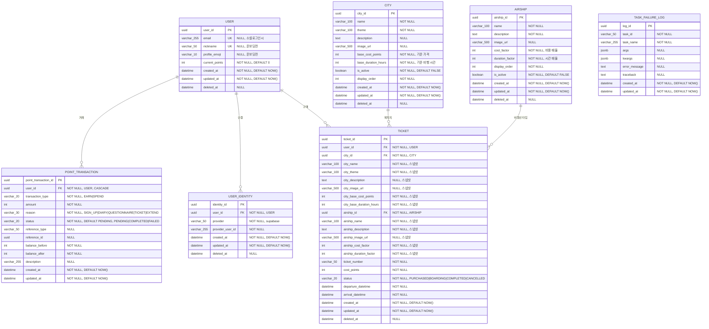

# B0 ERD (Entity Relationship Diagram)

## 데이터 타입 정보

### Primary Key (ID)

- **데이터베이스 타입**: `UUID` (PostgreSQL UUID 타입)
- **애플리케이션 생성**: UUID v7 (RFC 9562 표준)
- **이유**:
  - 시간순 정렬 가능 (타임스탬프 기반)
  - 공식 표준으로 장기적 안정성 보장
  - PostgreSQL 17+에서 `gen_uuid_v7()` 네이티브 지원
  - 인덱스 성능 우수 (순차적 생성으로 fragmentation 최소화)
  - 128비트로 UUID 컬럼에 저장 가능

## 구현 상태

### 구현 완료

- USER (users)
- USER_IDENTITY (user_identities)
- CITY (cities)
- AIRSHIP (airships)
- TICKET (tickets)
- POINT_TRANSACTION (point_transactions)
- TASK_FAILURE_LOG (task_failure_logs)

### 미구현 (Phase 1 예정)

- GUESTHOUSE
- ROOM
- ROOM_STAY
- CHAT_MESSAGE
- CONVERSATION_CARD
- DIRECT_MESSAGE_ROOM
- DIRECT_MESSAGE
- DIARY
- QUESTIONNAIRE

## ERD 다이어그램 (구현 완료)

---

## ERD 다이어그램 (전체 - 미구현 포함)

---

## 인덱스 정보

### 1. USER (users)

- `idx_users_email`: (email) UNIQUE, WHERE deleted_at IS NULL
- `idx_users_nickname`: (nickname) UNIQUE, WHERE deleted_at IS NULL

### 2. USER_IDENTITY (user_identities)

- `idx_user_identities_provider_user`: (provider, provider_user_id) UNIQUE, WHERE deleted_at IS NULL

### 3. CITY (cities)

- 별도 인덱스 없음 (추후 필요시 추가 예정)
- 예정: `(is_active, display_order)`

### 4. AIRSHIP (airships)

- `idx_airships_active_display_order`: (is_active, display_order), WHERE deleted_at IS NULL

### 5. TICKET (tickets)

- `idx_tickets_user_status`: (user_id, status, departure_datetime) UNIQUE, WHERE deleted_at IS NULL

### 6. POINT_TRANSACTION (point_transactions)

- `idx_transaction_user_status`: (user_id, status)
- `idx_transactions_user_created`: (user_id, created_at)
- `idx_transactions_user_type`: (user_id, transaction_type)
- `idx_transactions_reference`: (reference_type, reference_id)

### 7. TASK_FAILURE_LOG (task_failure_logs)

- 별도 인덱스 없음

---

### 미구현 테이블 인덱스 (예정)

### GUESTHOUSE

- 인덱스: `(city_id, guesthouse_type, is_active)`, `(city_id, is_active)`

### ROOM

- 인덱스:
  - `(guesthouse_id, status, current_capacity)` - 가용 룸 찾기 최적화
  - `(guesthouse_id, room_number)` UK
- 제약: `current_capacity <= max_capacity`
- 참고: deleted_at IS NULL 조건으로 삭제된 룸 제외

### ROOM_STAY

- 인덱스: `(room_id, status)`, `(user_id, status)`, `scheduled_checkout_time`

### CHAT_MESSAGE

- 인덱스: `(room_id, created_at)`, `expires_at`

### CONVERSATION_CARD

- 인덱스: `(city_id, is_active)`

### DIRECT_MESSAGE_ROOM

- 인덱스: `(room_id, status)`, `(guesthouse_id, status)`, `(user2_id, status)`

### DIRECT_MESSAGE

- 인덱스: `(dm_room_id, created_at)`, `(to_user_id, is_read)`

### DIARY

- 인덱스: `(room_stay_id)` UK, `(user_id)`, `(user_id, created_at)`

### CITY_QUESTION

- 인덱스: `(city_id, is_active, display_order)` - 도시별 활성 질문 조회

### QUESTIONNAIRE

- 인덱스: `(room_stay_id, city_question_id)` UK - 체류당 질문당 1개 답변
- 인덱스: `(user_id)`, `(user_id, created_at)` - 사용자별 조회

---

## 제약사항

### UNIQUE 제약 (구현 완료)

- USER: `email` (partial), `nickname` (partial) - WHERE deleted_at IS NULL
- USER_IDENTITY: `(provider, provider_user_id)` (partial) - WHERE deleted_at IS NULL
- TICKET: `(user_id, status, departure_datetime)` (partial) - WHERE deleted_at IS NULL

### UNIQUE 제약 (미구현)

- ROOM: `(guesthouse_id, room_number)`
- DIARY: `(room_stay_id)` - 체류당 1개
- QUESTIONNAIRE: `(room_stay_id, city_question_id)` - 체류당 질문당 1개

### 데이터 제약

- 닉네임: 2-10자
- 메시지 내용: 300자
- 일기 제목: 255자
- 일기 기분(mood): 20자
- 룸 최대 인원: 6명

### 자동 처리 (미구현)

- 메시지: 3일 후 자동 삭제 (expires_at)
- 체크아웃: 24시간 후 자동 처리 (scheduled_checkout_time)
- 1:1 대화: 체크아웃 시 자동 삭제

---

## ENUM 정의

### TICKET

- `status`: PURCHASED, BOARDING, COMPLETED, CANCELLED
  - PURCHASED: 구매 완료 (출발 대기 중)
  - BOARDING: 이동 중 (비행선 탑승 중)
  - COMPLETED: 도착 완료
  - CANCELLED: 취소됨

### GUESTHOUSE (미구현)

- `guesthouse_type`: MIXED, QUIET

### ROOM (미구현)

- `status`: ACTIVE, FULL

### ROOM_STAY (미구현)

- `status`: CHECKED_IN, CHECKED_OUT

### CHAT_MESSAGE (미구현)

- `message_type`: TEXT, CARD_SHARED, SYSTEM

### DIRECT_MESSAGE_ROOM (미구현)

- `status`: PENDING, ACCEPTED, REJECTED, ACTIVE, ENDED

### POINT_TRANSACTION

- `transaction_type`: EARN, SPEND
- `reason`: SIGN_UP, DIARY, QUESTIONNAIRE, TICKET, EXTEND
- `status`: PENDING, COMPLETED, FAILED

---

## 구현 참고사항

### Soft Delete 패턴

- `deleted_at` 컬럼 사용 (NULL = 활성, 값 있음 = 삭제됨)
- Partial Unique Index로 삭제되지 않은 레코드만 유니크 제약 적용
- `SoftDeleteMixin` 클래스로 공통 구현

### Audit 필드

- `created_at`: 레코드 생성 시간 (server_default)
- `updated_at`: 레코드 수정 시간 (server_default + onupdate)
- `AuditMixin` 클래스로 공통 구현

### 스냅샷 패턴 (Ticket)

- 티켓 생성 시점의 City, Airship 정보를 스냅샷으로 저장
- 원본 데이터 변경에도 티켓 정보 보존
- FK는 유지하되, 실제 표시에는 스냅샷 데이터 사용

### 메시지 전송 제한 (스팸 방지) - 미구현

- Redis를 이용한 Rate Limiting 구현
- 채팅 메시지: 2초에 1회 제한
- 대화 신청: 1분에 3회 제한
- 키 형식: `rate_limit:{action}:{user_id}:{target_id}`

### 체크아웃 알림 - 미구현

- Celery 태스크로 구현
- 체크인 시 알림 태스크 예약 (eta = checkout_time - 1hour)
- 연장 시 기존 태스크 취소 후 재예약
- 알림 채널: 인앱 알림

### 게스트하우스 타입 - 미구현

- 현재: 모든 게스트하우스는 MIXED 타입으로 설정
- 향후: QUIET 타입 추가 예정

### 도시별 문답지 질문 - 미구현

- 세렌시아(관계): 관계 관련 질문 3개
- 로렌시아(회복): 회복 관련 질문 3개
- 질문은 애플리케이션 코드에서 관리

### 대화 카드 사용 - 미구현

- 무제한 사용 가능
- 동일 카드 중복 선택 가능
